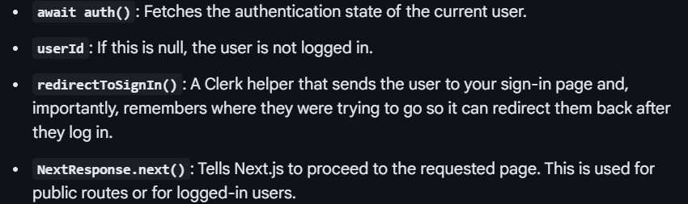

Refer this for protectedRoutes: https://clerk.com/docs/reference/nextjs/clerk-middleware

await auth(): Fetches the authentication state of the current user.
userId: If this is null, the user is not logged in.
redirectToSignIn(): A Clerk helper that sends the user to your sign-in page and, importantly, remembers where they were trying to go so it can redirect them back after they log in.
NextResponse.next(): Tells Next.js to proceed to the requested page. This is used for public routes or for logged-in users.

using react drop zone for the imageUploader